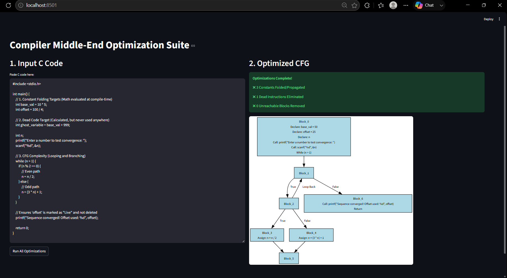

# 🚀 Static Code Analyzer & CFG Optimizer

> A compiler middle-end optimization framework that parses C programs into Abstract Syntax Trees (AST), constructs Control Flow Graphs (CFG), performs classical compiler optimizations, and visualizes the optimized execution flow through an interactive web dashboard.

---

## 📌 Overview

This project implements a simplified compiler **middle-end** in Python, inspired by modern compiler optimization pipelines.

Starting from raw **C source code**, it:

- Parses the code into an **Abstract Syntax Tree (AST)** using `pycparser`
- Constructs a mathematical **Control Flow Graph (CFG)**
- Performs multiple static analysis passes
- Applies classical compiler optimizations
- Visualizes the optimized CFG using **Graphviz**
- Benchmarks optimization performance on large datasets such as **CodeNet** and **SV-COMP**

The project also includes an interactive **Streamlit dashboard** for visual exploration of CFG transformations.

---

## ✨ Features

### 🔹 AST Generation
- Parses ANSI C programs using **pycparser**
- Converts source code into an Abstract Syntax Tree

### 🔹 Control Flow Graph (CFG) Construction
- Builds CFG nodes and directed edges
- Models execution paths using graph theory

### 🔹 Compiler Optimizations

#### ✅ Constant Folding
Evaluates constant expressions during compile time.

Example:

```c
int x = 5 * 4;
```

↓

```c
int x = 20;
```

---

#### ✅ Constant Propagation

Propagates known constant values through subsequent statements.

---

#### ✅ Live Variable Analysis

Computes:

- `live_in`
- `live_out`

sets for every CFG node.

---

#### ✅ Dead Code Elimination

Removes assignments whose values never contribute to future computation.

Example:

```c
int x = 10;
x = 20;
return x;
```

↓

```c
x = 20;
return x;
```

---

#### ✅ Unreachable Code Removal

Uses CFG traversal to identify and eliminate execution blocks that cannot be reached from the function entry point.

---

## 📊 Interactive Dashboard

The Streamlit application allows users to:

- Paste custom C programs
- Generate AST
- Visualize the CFG
- Observe optimization passes
- Inspect optimized execution flow

---

## 📁 Project Structure

```text
CFG_OPTIMIZER/
│
├── datasets/                  # CodeNet & SV-COMP benchmark datasets
│
├── app.py                     # Streamlit dashboard
├── batch_runner.py            # Batch benchmarking framework
├── main.py                    # CFG builder & optimization engine
│
├── codenet_report.json        # Generated benchmark report
├── sv_comp_report.json        # Generated benchmark report
│
├── cfg_demo.png               # Dashboard preview
└── README.md
```

---

## 🛠️ Tech Stack

### Programming Language

- Python

### Parsing

- pycparser

### Graph Modeling

- NetworkX

### Graph Visualization

- Graphviz
- pydot

### Web Interface

- Streamlit

---

## ⚙️ Installation

### 1. Clone the Repository

```bash
git clone https://github.com/adi-2254/cfg_optimizer.git
cd cfg_optimizer
```

---

### 2. Create a Virtual Environment

**Linux / macOS**

```bash
python -m venv env
source env/bin/activate
```

**Windows**

```bash
python -m venv env
.\env\Scripts\activate
```

---

### 3. Install Dependencies

```bash
pip install streamlit networkx pycparser pydot
```

---

### 4. Install Graphviz

Graphviz is required for CFG rendering.

### Windows

Download from:

https://graphviz.org/download/

> During installation, enable **"Add Graphviz to PATH"**.

### macOS

```bash
brew install graphviz
```

### Ubuntu / Debian

```bash
sudo apt-get install graphviz
```

---

## 🚀 Usage

### Launch Interactive Dashboard

```bash
streamlit run app.py
```

Open your browser and paste any C program to visualize:

- AST
- CFG
- Optimized CFG

---

### Run Batch Benchmarking

Evaluate the optimizer on large benchmark datasets.

```bash
python batch_runner.py
```

The generated reports include:

- Optimization statistics
- Number of optimized CFG nodes
- Removed dead code
- Reachability metrics

Reports are stored as:

```
codenet_report.json
sv_comp_report.json
```

---

## 📈 Supported Optimizations

| Optimization | Implemented |
|--------------|:----------:|
| AST Generation | ✅ |
| CFG Construction | ✅ |
| Constant Folding | ✅ |
| Constant Propagation | ✅ |
| Live Variable Analysis | ✅ |
| Dead Code Elimination | ✅ |
| Unreachable Code Removal | ✅ |
| CFG Visualization | ✅ |
| Dataset Benchmarking | ✅ |

---

## 📸 Demo

> Add a screenshot named **cfg_demo.png** in the repository root.

```markdown

```

---

## 👨‍💻 Authors
- **Anurag Raj (2024CSB1101)**
- **Aditya Raj (2024CSB1003)**
- **Aakash Jaisinghani (2024CSB1092)**

If you found this project useful, consider ⭐ starring the repository.